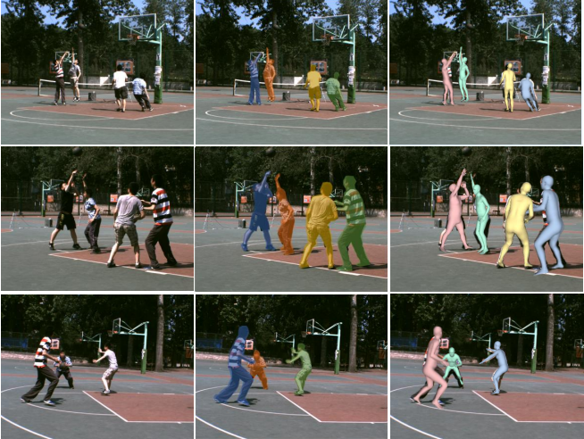

# 3DMPB-dataset

Dataset proposed in "Pose2UV: Single-shot Multi-person Mesh Recovery with Deep UV Prior"  
[[ProjectPage]](https://www.yangangwang.com/papers/HBZ-Pose2UV-2022-06.html) [[paper]](https://www.yangangwang.com/papers/HBZ-pose2uv-2022-06.pdf) @ TIP2022. 

<div align="center">

<p> Samples of 3DMPB Dataset</p>
</div>

**3DMPB** is a multi-person dataset in the outdoor sport field with human interaction occlusion and image truncation. This dataset provides annotations including bounding-box, human 2D pose, SMPL model annotations, instance mask and camera parameters.


## Statistics
**Note:** **Not** all the instances in this dataset are annotated in consideration of some inaccurate annotations or wrong relative occlusion. 

|          | bbox    | keypoint   | mask  | SMPL |
| -------- | :-----: | :--------: | :----: | :-----:|
| Images   | 13,665  | 13,665     | 13,665 | 13,665 |
| Persons  | 25,122  | 25,122     | 25,122 | 25,122 |

## Download Links
\[[Baidu Netdisk](https://pan.baidu.com/s/12nB-B-JgcCP2ulVmnWy4Lg?pwd=mo07)\]
\[[Google Drive](https://drive.google.com/file/d/1sBOfnv8i98vcGytH_s2GstHPNscCEho5/view?usp=sharing)\]

We also provide full videos for 3DMPB dataset.


\[[3DMPB-video](https://pan.baidu.com/s/19OZSEOu330Gul89IobKvbQ?pwd=xcyv)\]


## Visualization
### Requirements 
* python3
* numpy
* pytorch
* pyrender
### Prepare dataset 
Please download the dataset and extract under `./3DMPB`. Due to the licenses, please download SMPL model file [here](http://smplify.is.tuebingen.mpg.de/). The folder structure is shown as follows:
```
|-- 3DMPB
`-- |-- images
    |   |-- 000000.jpg
    |   |-- 000001.jpg
    |   |-- 000002.jpg
    |   |-- ...
    |-- masks
    |   |-- 000000_00.jpg
    |   |-- 000000_01.jpg
    |   |-- 000000_02.jpg
    |   |-- 000001_00.jpg
    |   |-- 000002_00.jpg
    |   |-- ...
    |-- annot.json
|-- data
`-- |-- SMPL_NEUTRAL.pkl    
```
### Visualization
#### visualize 2D keypoints and boundingbox
```
python vis_dataset.py --dataset_dir 3DMPB  --output_dir output 
```
#### visualize 3D meshes
```
python vis_dataset.py --dataset_dir 3DMPB  --output_dir output --vis_smpl True
```

## Citation
If you find this dataset useful for your research, please consider citing the paper.
```
@article{huang2022pose2uv,
  title={Pose2UV: Single-shot Multi-person Mesh Recovery with Deep UV Prior},
  author={Huang, Buzhen and Zhang, Tianshu and Wang, Yangang},
  journal={IEEE Transactions on Image Processing},
  year={2022},
  volume={31},
  pages={4679-4692}
}
```